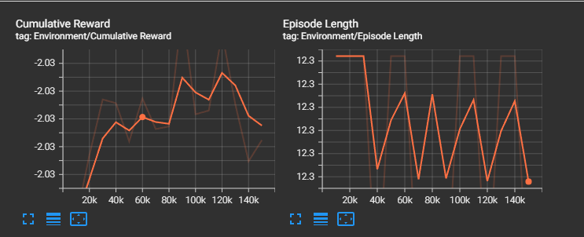

# ML-Agent Jump Training

Deze opdracht implementeert een ML-Agent in Unity die leert om over obstakels te springen op het juiste moment.

---

## Project Setup

### Benodigdheden
- ML-Agents package

### Scene Setup
1. Maak een nieuw Unity project en importeer het ML-Agents package.
2. Creëer een simpele scene met:
   - Een vlak oppervlak (plane).
   - Een agent met een Rigidbody.
   - Een obstakel-generator die meerdere obstakels genereert.

---

## Components

### MLAgent Script
Het `MLAgent` script regelt het gedrag van de agent. Het verzamelt observaties, onderneemt acties en ontvangt beloningen. Het script wordt toegevoegd aan de agent in de Unity scene.

Belangrijkste functies:
- **Observaties**: De agent observeert of hij op de grond staat, of er een obstakel is gedetecteerd, en de tijd sinds de laatste sprong.
- **Acties**: De agent beslist of hij moet springen.
- **Beloningen**: De agent ontvangt beloningen voor succesvol gedrag, zoals het ontwijken van obstakels.

### DetectionZone Script
Het `DetectionZone` script wordt toegevoegd aan een trigger-collider voor de agent. Het detecteert naderende obstakels en informeert de agent.

---

## Trainingsconfiguratie

De training wordt geconfigureerd in een YAML-bestand. Hier zijn de belangrijkste parameters:

```yaml
behaviors:
  CubeAgent:
    trainer_type: ppo
    hyperparameters:
      batch_size: 1024
      buffer_size: 10240
      learning_rate: 2.0e-4
      beta: 5.0e-4
      epsilon: 0.2
      lambd: 0.99
      num_epoch: 3
      learning_rate_schedule: linear
      beta_schedule: constant
      epsilon_schedule: linear
    network_settings:
      normalize: false
      hidden_units: 256
      num_layers: 2
    reward_signals:
      extrinsic:
        gamma: 0.99
        strength: 1.0
    max_steps: 150000
    time_horizon: 64
    summary_freq: 10000
```

## Resultaten



De agent begon met vaak willekeurig te springen omdat hij nog geen pantroon geleerd had. Hierna begon hij de obstakels te herkennen en sprong hij vaker op het juiste moment. Tegen het einde wist hij heel vaak wanneer hij moest springen en sprong dus consistent over het obstakel en zagen we dat het gemiddelde beloning stabiel bleef.